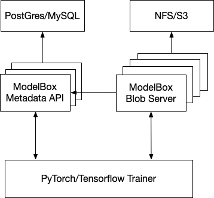

# ModelBox - A Machine Learning model management service

ModelBox is a model management, instrumentation and transformation service. It can integrate with Deep Learning frameworks to provide model checkpoint and artifact tracking and optional features such as transforming models to optimize them for inference, serving them to inference engines, measuring performance, and exposing neural network architecture.

## Features
- Model versioning and lineage tracking of Models in relation to Experiments which created them.
- Labelling models and checkpoints to track the environement they are deployed in, metrics, and other related metadata meaningful to users.
- Integrates with DL Frameworks like Keras and PyTorch Lightening for checkpoint storage and for fault tolerant training.
- Load production ready models in inference engines directly from ModelBox - clients in Python, Rust, Go, etc. C++ library is in the works.
- Python SDK to integrate with ML Frameworks.

## Planned Features
- Add retention policies written in any WASM compatible language which has all the model and checkpoint related metadata available.
- Add RBAC based access control for models and checkpoints for compliance.
- Create a worker infrastructure which automatically transforms models, benchmarks for performance on inference hardware, etc, and update the model metadata.
- Make the worker architecture pluggable such that users can write custom workers any langugage while the model, metrics and other metadata are available to the runtime, abstracting the storage and other infrastructure primitives.

## Concepts and Understanding the ModelBox API


### Namespace
A Namespace is a mechanism to organize related models or models published by a team. They are also use for access control and such to the metadata of uploaded models, invoking benchmarks or other model transformation work. Namespaces are automatically created when a new model or experieemnt specifies the namespace it wants to be associated with.

### Model
A model is an object to track common metadata, and to apply policies on models created by experiments to solve a machine learning task. For ex. datasets to evaluate all trained models of a task can be tracked using this object. Users can also add rules around retention policies of trained versions, setup policies for labelling a trained model if it has better metrics on a dataset, and meets all other criterion.

### Model Version
A model version is a trained model, it includes the model binary, related files that a user wants to track - dataset file handles, any other metadata, model metrics, etc. Model versions are always related to a Model and all the policies created for a Model are applied to Model Versions.

### Experiment and Checkpoints
Experiments are used to injest model checkpoints created during a training run. ModelBox is not an experiment metadata tracker so there is no support for rich experiment management which are available on experiment trackers such as Weights and Biases, the experiment abstraction here exists so that we can track and injest model checkpoints which eventually become model versions if they have good metrics and does well in benchmarks.

## Architecture
ModelBox has the following components
- Metadata Server
- Blob Server
- Cli
- Client Libraries 

### Metadata Server
Meta Data Server is responsible for tracking metadata around models which are created by the training frameworks or users who are uploading trained models and other training artifacts. The Meta Data server exposes a GRPC endpoint for clients to communicate with the server. The metadata server has a pluggable architecture to allow using various databases such as MySQL, PostGres, etc. Additional datastore support can be very easily added by implementing the metadata storage inferface.

### Blob Server
Blob Server exposes APIs for clients to upload training artifacts and download models in a streaming fashion across a large number of storage services. The Blob Servers are stateless and hence you can scale them based on your serving needs. You can create dedicate serving capabilities for certain training workloads or for streaming models to production inference servers for example.
Blob Serves have pluggable storage which allows using various backends such as File System based services like NAS or NFS or Cloud Blob Storage services such as S3.

Blob Servers are optional, and users are free to use whichever blob serving capabilites they already have. But, for advanced features such as loading models directly from inference engines, transforming models by ModelBox workers, the blob servers are required as they provide an uniform API to store and retrieve models.

### Cli
The ModelBox CLI provides an interface to interact with the Metadata API and Blob Storage API and create and download models and all other aspects of the service.

### SDK and Client Libraries
The SDK/client libraries are meant for integration with Deep Learning and ML frameworks to integrate ModelBox with the experiment code which creates the model and other training artifacts. The libraries can also be used with applications or control planes which wants to use ModelBox in a larger in house Machine Learning platform.

### High Level Architecture



## Configuration
ModelBox Server and Cli are configured by toml files and same configuration can be generated by the CLI. Please refer to the comments on the config and the documentation below to understand what the attributes of the configuration does.

### Server Configuration
- listen_addr: The interface and port on which the server will be listening for Client RPC Requests.

#### Storage Configuration
- metadata_storage: The name of the storage backend which ModelBox is going to use for storing metadata about models. Possible values - 
    - `mysql`
         `Host` Host of the MySQL server.
         `Port` Port of the MySQL server.
         `Password` Password of the server.
    - `integrated`

### Cli Configuration
- server_addr: The address of the Metadata Server

## Deployment

All the components of ModelBox is packaged in a single binary which eases deployment in production. 

## Operation Examples

### Starting the metadata server
Generate the config
```
modelbox server init-config
```

Edit the config and start the server

```
$ modelbox server start --config-path ./path/to/modelbox.toml
```

### CLI Examples
Generate the client config
```
modelbox client init-config
```

Create a Project
```
modelbox client projects create --name langtech --owner your@email.com
```

List Projects
```
modelbox client projects list
```

Create an experiment. Experiments are usually created programatically via the modelbox SDK which integrates with deep learning frameworks.
```
modelbox client experiments create --project-id langtech --owner your@email.com --name wav2vec-lid
```

List Experiments for project 
```
modelbox client experiments list --project langtech
```

Create a Model for the experiment.
```
modelbox client models create 
```

## Logging

## Monitoring

## Demos 
- [Pytorch Lightning Integration](docs/lightning/train.py)
