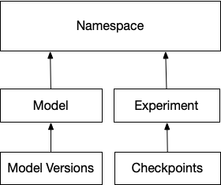

# Concepts and Entities

## Namespace

A Namespace is a mechanism to organize related models or models published by a team. They are also used for access control to the metadata of uploaded models, invoking benchmarks, or other model transformation work. Namespaces are automatically created when a new model or experiment specifies a new namespace.

## Model

A model is an object to track standard metadata and apply policies on models created by experiments to solve a machine learning task. For example - datasets to evaluate and train the model can be tracked. Users can also add rules around retention policies of trained models and set up policies for labeling a trained model if it has good metrics on a dataset and meets all other production criteria.

## Model Version

A model version is a trained model, it includes the model binary, related files that a user wants to track - dataset file handles, any other metadata, model metrics, etc. Model versions are always related to a Model, and all the policies created for a Model are applied to Model Versions.

## Experiment and Checkpoints

Experiments are the abstraction to store metadata and events from training jobs that produce trained models. Checkpoints from experiments are automatically ingested and can be a means to get fault-tolerant training or set up automatic conversions to models if the metrics are good. Some examples of metadata logged from an experiment are hyperparameters, structure and shape of the models, training accuracy, loss and other related metrics, hardware metrics of the trainer nodes, checkpoint binaries, and even training code with dependencies, etc.

## Metrics

Metrics can be logged for experiments and models. Metrics are key, value pairs, the value being a series of float, tensor(serialized as strings), or even bytes that are logged over time. Every metric log can have a step and wallclock attribute associated with them, which makes them useful in tracking things like accuracy during training or hardware metrics. Model Metrics can be expressed as simple key/value pairs.

## Artifacts

Artifacts such as datasets and trained models or checkpoints can be either uploaded to ModelBox, or if they are stored externally, they can be tracked as metadata attached to experiments and model objects.

## Events

Events are generated by external systems running the training experiments, inference engines consuming the Models, or even other ML Operations services consuming the models or metadata to benchmark or deploy a model. Events are useful for debugging or operability of models or training platforms.

For example, if events are logged at the start of an epoch, before and after writing a checkpoint, looking at the timestamps allows an engineer to understand which operation is taking too much time if training slows down.

## Audit Events 

Audit events are automatically generated by ModelBox when metadata about an experiment or model is updated, created, or destroyed. Events are also logged automatically when artifacts are uploaded or downloaded. They are useful in production systems to know when and where models are consumed, when new models are created by experiments, etc.
